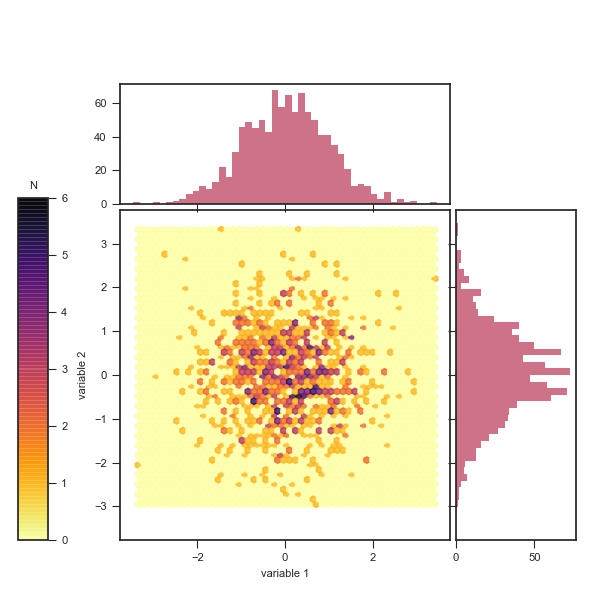

# qplots
A small python plotting library

This is the qplots library produced primarily by [Ashley Setter](https://github.com/AshleySetter). It is in part accompanying and being used by my [datahandling library](https://github.com/AshleySetter/datahandling). This library has the goal of making every aspect customisable, open and transparent.

Example of joint_plot:

# Known Issues

If this library is imported along with seaborn, the fontsize argument to the various plotting functions doesn't work unless you add the line `seaborn.reset_orig()` after importing seaborn, which undoes it's changes to the matplotlib defaults.
